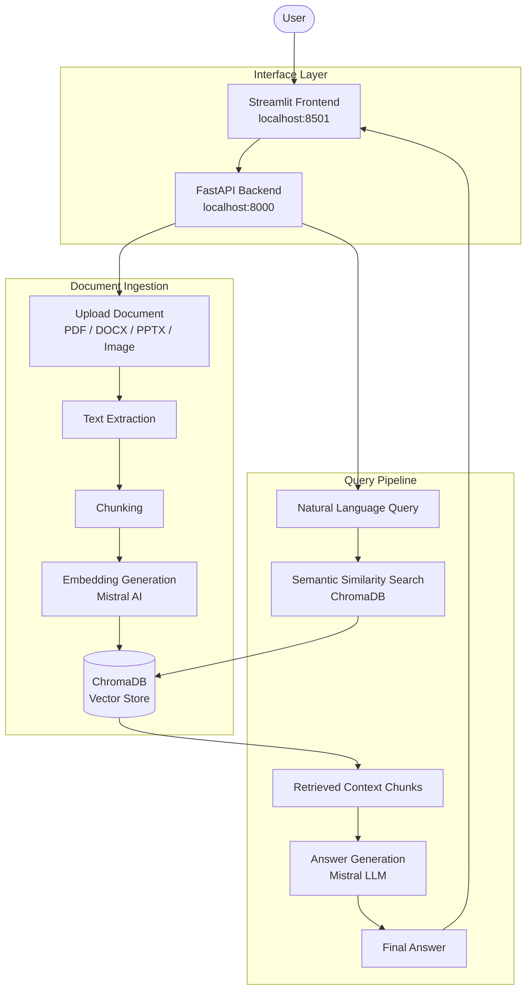

# Mistral RAG System
 
A lightweight Retrieval-Augmented Generation (RAG) system built using FastAPI, ChromaDB, LangChain, Mistral AI, and Streamlit.
 
This project allows users to upload documents, store their embeddings in a local vector database, and ask natural-language questions that are answered using retrieved context from those documents.
 
---
 
## Features
 
- Upload documents: PDF, DOCX
- Optional support for PPTX and Images (based on Python version and dependencies)
- Automatic text extraction and chunking
- Embedding generation using Mistral AI embeddings
- Persistent vector storage using ChromaDB
- Semantic similarity search
- Context-aware answers generated by Mistral LLM
- REST API (FastAPI) and Interactive UI (Streamlit)
---
 
## Architecture Overview
 

 
---
 
## Project Structure
 
```text
mistral-rag-system/
|
|-- app.py              # Streamlit frontend
|-- main.py             # FastAPI backend
|-- utils.py            # RAG utilities (embedding, storage, retrieval)
|-- requirements.txt    # Python dependencies
|-- .env.example        # Environment variable template
|-- uploads/            # Temporary uploaded files
`-- chroma_db/          # Persistent ChromaDB storage
```
 
---
 
## Python Version Notes
 
| Version | Image & PPTX Support |
|---|---|
| Python 3.13 | Not supported |
| Python 3.12 or lower | Fully supported |
 
---
 
## Tech Stack
 
| Component | Purpose |
|---|---|
| FastAPI | Backend API |
| Streamlit | Frontend UI |
| ChromaDB | Vector database |
| LangChain | RAG orchestration |
| Mistral AI | Embeddings and LLM |
 
---
 
## Quick Start
 
### 1. Install Dependencies
 
```bash
pip install -r requirements.txt
```
 
### 2. Configure Environment Variables
 
Create a `.env` file in the project root:
 
```env
MISTRAL_API_KEY=your_mistral_api_key_here
```
 
Obtain your API key from the [Mistral AI Console](https://console.mistral.ai).
 
### 3. Run the Backend
 
```bash
uvicorn main:app --reload
```
 
The API will be available at `http://localhost:8000`.
 
### 4. Run the Frontend
 
```bash
streamlit run app.py
```
 
The UI will be available at `http://localhost:8501`.